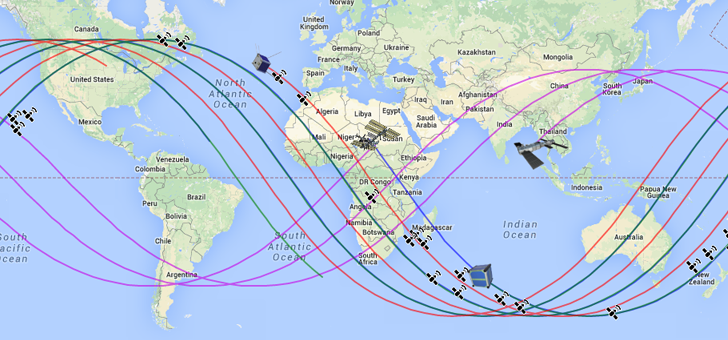

# OrbitMaps.js



A small library forked from [Orbits.js](https://github.com/rossengeorgiev/orbits-js) for mapping satellite orbits from TLE with GeoJSON.

[Live preview](http://rossengeorgiev.github.io/orbits-js/preview.html)

## Example usage

```javascript
var myMap = new google.maps.Map(...);
var myTLE = new orbits.TLE(tle_text);
var mySat = new orbits.Satellite({ map: myMap, tle: myTLE});

// You can also parse a file containing many TLEs
var TLE_Array = orbits.util.praseTLE(tle_text);
```
## Documentation

Explore the library from [here](http://rossengeorgiev.github.io/orbits-js/).

## Library based on

* [Models for Propagation of NORAD Element Sets](http://www.celestrak.com/NORAD/documentation/spacetrk.pdf)
*By Felix R. Hoots and Ronald L. Roehrichm, December 1980*
* [Orbital Coordinate Systems, Part III](http://www.celestrak.com/columns/v02n03/)
*By Dr. T.S. Kelso*
